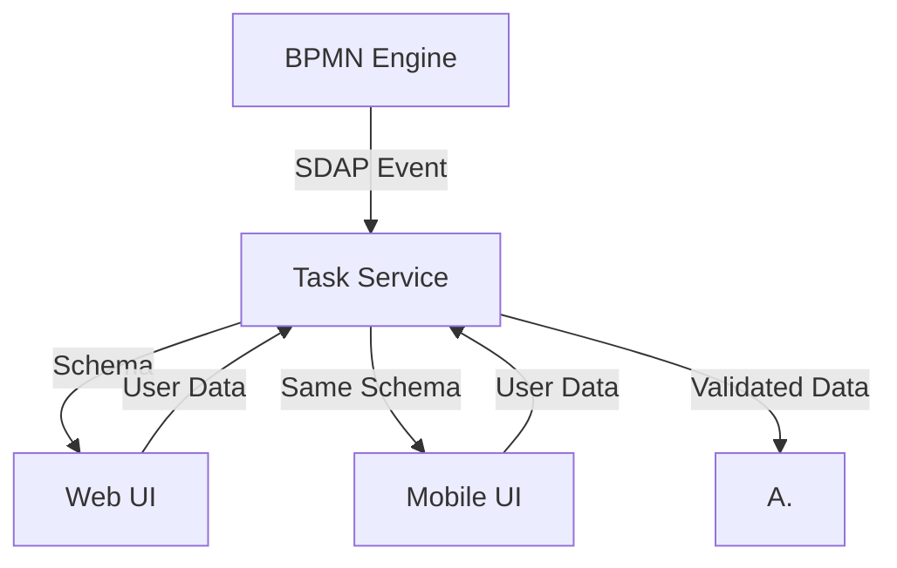

# Use Case: Dynamic UI for Business Process Forms

## Business Context
A financial institution has multiple approval workflows (loan approval, invoice processing, compliance checks). Each workflow has forms that change quarterly due to regulatory updates.

## The Problem
- Frontend teams cannot keep up with backend changes
- Form changes require synchronized releases across 5+ microservices
- Different UI frameworks (web, mobile) need separate implementations

## SDAP Implementation

### Architecture


**Example Event (JSON):**
```json
{
  "metadata": {
    "processId": "order-process-123",
    "actionType": "APPROVE_PAYMENT",
    "actionId": "action-456",
    "timestamp": "2024-01-15T10:30:00Z",
    "correlationId": "corr-789",
    "schemaHash": "sha256:abc123def456..."
  },
  "schema": {
    "condition": {
      "toDraft": {
        "value": false,
        "type": "Boolean",
        "required": false,
        "uiHint": "checkbox",
        "label": "Send to Draft",
        "description": "Return payment to draft status for additional review"
      },
      "toExecution": {
        "value": true,
        "type": "Boolean", 
        "required": false,
        "uiHint": "checkbox",
        "label": "Approve for Execution",
        "description": "Approve payment for immediate processing"
      },
      "toCancel": {
        "value": false,
        "type": "Boolean",
        "required": false,
        "uiHint": "checkbox", 
        "label": "Cancel Payment",
        "description": "Cancel this payment request entirely"
      }
    },
    "description": {
      "value": "",
      "type": "String",
      "required": true,
      "uiHint": "textarea",
      "label": "Comments",
      "description": "Provide additional details about your decision",
      "placeholder": "Enter your comments here...",
      "maxLength": 1000
    },
    "priority": {
      "value": "",
      "type": "Enum",
      "required": false,
      "uiHint": "select",
      "label": "Priority Level",
      "description": "Select the urgency level for this approval",
      "options": [
        {"value": "low", "label": "Low Priority"},
        {"value": "medium", "label": "Medium Priority"}, 
        {"value": "high", "label": "High Priority"},
        {"value": "critical", "label": "Critical"}
      ]
    },
    "attachments": {
      "value": [],
      "type": "Array",
      "required": false,
      "uiHint": "file-upload",
      "label": "Supporting Documents",
      "description": "Upload supporting documents (max 5 files)",
      "maxItems": 5,
      "allowedTypes": ["pdf", "jpg", "png", "doc", "docx"]
    }
  },
  "context": {
    "processName": "Order Processing",
    "stepName": "Payment Confirmation",
    "userId": "user-123",
    "deadline": "2024-01-16T10:30:00Z"
  }
}
```
**Note:** schema can be null if the schemaHash is already known by the consumer.

## Results
- Time-to-market for form changes reduced
- Zero frontend redeployments for schema changes
- Unified form rendering across web and mobile platforms
