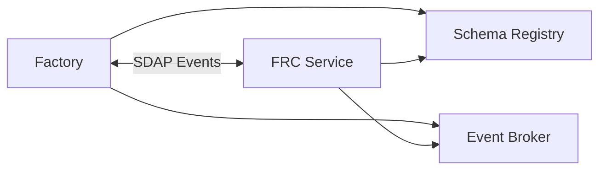

# Use Case: Backend Integration (Bidirectional Contracts) (Factory ↔ FRC)

## Business Context
The roles of Producer (who defines the expected data schema) and Consumer (who fulfills it) in SDAP are flexible and contextual. They can be defined per interaction within a business process (e.g., Service A produces a request, Service B consumes it and then produces a response) or can be a fixed architectural characteristic of a system (e.g., a central reporting engine is designed primarily as a Consumer). This duality allows SDAP to model both dynamic, peer-to-peer workflows and stable, hub-and-spoke integrations.

## The Problem
- Factory data format changes every 6 months
- FRC reporting requirements change quarterly
- Current point-to-point integration breaks frequently
- Audit trails are incomplete

### Interaction Patterns

| **Direction** | **Producer (Defines Schema)** | **Consumer (Fulfills Schema)** | **Schema's Purpose** |
| :--- | :--- | :--- | :--- |
| **Factory → FRC**<br>(Report Request) | **Factory** defines the report format and processing rules. | **FRC Service** generates a report matching the specification. | **`<reportSpecification>`** – A contract for the report's content, format, and delivery. |
| **FRC → Factory**<br>(Data Request) | **FRC Service** defines the required raw data structure. | **Factory** provides data conforming to the specified structure. | **`<inputSpecification>`** – A contract for the data's types, fields, and validation rules. |

### Architecture


### Example: A Two-Phase SDAP Dialogue
Consider a secure workflow where data exchange and report generation are separate, governed by SDAP contracts.
z
#### Phase 1: FRC Requests Data (FRC as Producer)

```xml
<!-- Event from FRC Service (Producer) to Factory (Consumer) -->
<sdapEvent>
  <metadata>
    <processId>data-request-batch-789</processId>
    <actionType>SUBMIT_OPERATIONS_DATA_V1</actionType>
    <actionId>urn:uuid:98765432-1234-5678-9876-543210123456</actionId>
    <timestamp>2024-01-15T10:30:00Z</timestamp>
    <correlationId>regulatory-report-q4-2023</correlationId>
    <schemaHash>sha256:data_request_schema_v1</schemaHash>
  </metadata>
  <schema>
    <inputSpecification format="JSON">
      <structure>
        <field name="transactionId" type="String" required="true"/>
        <field name="amount" type="Decimal" precision="2"/>
        <field name="currency" type="String" length="3"/>
      </structure>
      <delivery method="SFTP" path="/incoming/frc/requests/"/>
    </inputSpecification>
  </schema>
  <context>
    <reportingPeriod>2023-Q4</reportingPeriod>
    <deadline>2024-01-31T23:59:59Z</deadline>
  </context>
</sdapEvent>
```

## Outcome: 
### The Factory (Consumer) fulfills this schema by formatting its internal data to match the requested structure and delivering a valid JSON file.

## Phase 2: Factory Requests Report (Factory as Producer)

```
<!-- Event from Factory (Producer) to FRC Service (Consumer) -->
<sdapEvent>
  <metadata>
    <processId>regulatory-reporting-q4-2023</processId>
    <actionType>GENERATE_REGULATORY_REPORT_1.2</actionType>
    <actionId>urn:uuid:22334455-6677-8899-aabb-ccddeeff0011</actionId>
    <timestamp>2024-01-15T14:30:00Z</timestamp>
    <!-- СВЯЗЬ С ПРЕДЫДУЩИМ СОБЫТИЕМ -->
    <correlationId>regulatory-report-q4-2023</correlationId>
    <schemaHash>sha256:report_schema_v1_2</schemaHash>
  </metadata>
  <schema>
    <reportSpecification>
      <processing>
        <aggregation>
          <groupBy field="currency"/>
          <calculate field="amount" function="SUM" outputField="total"/>
        </aggregation>
      </processing>
      <output>
        <format type="PDF"/>
      </output>
      <delivery method="SFTP" path="/outgoing/reports/"/>
    </reportSpecification>
  </schema>
  <context>
    <!-- ЯВНАЯ ССЫЛКА НА РЕЗУЛЬТАТ ПРЕДЫДУЩЕГО СОБЫТИЯ -->
    <dataBatchId>batch_q4_2023</dataBatchId>
    <sourceActionId>urn:uuid:98765432-1234-5678-9876-543210123456</sourceActionId>
    <reportingPeriod>2023-Q4</reportingPeriod>
    <deadline>2024-01-31T23:59:59Z</deadline>
  </context>
</sdapEvent>
```
## Outcome: 
### The FRC Service (Consumer) fetches the data submitted in Phase 1, processes it exactly as defined in the <reportSpecification>, and delivers the final report.
- Key Advantage: Decoupling Through Dynamic Contracts
- This bidirectional flow eliminates hard-coded dependencies:
- No Static APIs: Services interact via runtime schemas, not pre-defined interfaces.
- Independent Evolution: Either side can change its data requirements by publishing a new schema version (e.g., SUBMIT_OPERATIONS_DATA_V2).
- Role Flexibility: The same SDAP client enables a service to be a Producer in one flow and a Consumer in another.
- Conclusion: SDAP enables true loose coupling in backend integration by making the data contract explicit, versioned, and carried within each interaction. It solves schema synchronization by allowing any service to declare "this is the data shape I expect" for any given action.

## Results
- Clear audit trail: Each interaction logged with schemaHash
- Reduced development time: New report types added in days, not months

* [SDAP readme](README.md)
* [Schema-Driven Action Propagation (SDAP) for Dynamic UI in Business Processes](use-cases/01-dynamic-ui-integration.md)
